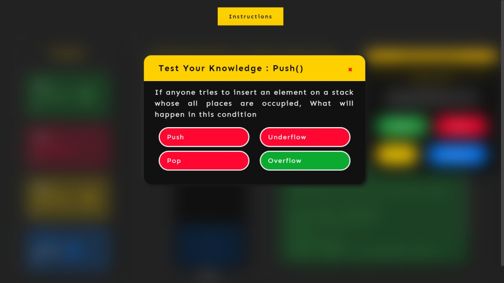

This folder has<br>
### Aim <br>
To understand the concept of implementation of stack using array<br>
### Theory <br>
Stack is an abstract data type with a bounded(predefined) capacity, commonly used in most programming languages. A real-world stack allows operations at one end only that is top. Arrangement of plates is a good example of stack. Whenever we want to ask an element in somewhere between the stack we have to go through the top elements first. This feature makes it LIFO data structure. LIFO stands for Last-in-first-out. The element added first is to be removed last.. In stack terminology, adding an item to the stack is called PUSH operation and removing an item from the stack is called POP operation.<br><br>

<b>Basic Operations</b><br>
1.push-aadingan a item into a stack on top.<br>
2.pop- Deleting  an item from top of the stack.<br>
3.peek-check the last or top element in the stack.<br>
4.IsEmpty- check if stack is empty.

<br>

### Procedure <br>
##### These procedure steps will be followed on the simulator <br>
1. After going through the theory and pretest, click the "Simulation" tab <br>
2.The simulator will display the instruction,user will read the instruction <br><br>
<br>
3.After clicking on "Create your own stack?"simulator appear with emplty stack:<br> <br>
<br><br>
4.Providing input and after clicing on "push" button:<br> <br>
<br><br>
5.A quiz window pop to ask question about push operation <br> <br>
<br><br>
6.Clicking on "pop" button: <br> <br>
<br>
7.A quiz window pop to ask queastion about pop operation<br><br>
<br>
8.A quiz window pop to ask question about isempty operation <br> <br>
<br>


### Pre Test <br>
Please attempt the following questions

1. How do you initialize an array in C?<br>
a) int arr[3] = (1,2,3);<br>
b) int arr(3) = {1,2,3};<br>
<b>c) int arr[3] = {1,2,3};</b><br>
d) int arr(3) = (1,2,3);<br>
  
2. Which of these best describes an array?<br>
a) A data structure that shows a hierarchical behaviour<br>
<b>b) Container of objects of similar types</b><br>
c) Arrays are immutable once initialised<br>
d) Array is not a data structure<br>

3.What are the disadvantages of arrays?<br>
a) Data structure like queue or stack cannot be implemented<br>
<b>b) There are chances of wastage of memory space if elements inserted in an array are lesser than the allocated size</b><br>
c) Index value of an array can be negative<br>
d) Elements are sequentially ac<br>

4.Which of the following real world scenarios would you associate with a stack data structure?<br>
a) piling up of chairs one above the other<br>
b) people standing in a line to be serviced at a counter<br>
c) offer services based on the priority of the customer<br>
<b>d) tatkal Ticket Booking in IRCTC</b><br>

5. What does the following function check for? (all necessary headers to be included and function is called from main)<br>
```
   #define MAX 10<br>
 
   typedef struct stack<br>
   {<br>
        int top;<br>
	int item[MAX];<br>
   }stack;<br>
 
   int function(stack *s)<br>
   {<br>
        if(s->top == -1)<br>
	    return 1;<br>
	 else return 0;<br>
   }
   ```
a) full stack<br>
b) invalid index<br>
<b>c) empty stack</b><br>
d) infinite stack<br>

### Post Test <br>

1. What does ‘stack underflow’ refer to?<br>
a) accessing item from an undefined stack<br>
b) adding items to a full stack<br>
<b>c) removing items from an empty stack</b><br>
d) index out of bounds exception<br>

2. What is the time complexity of pop() operation when the stack is implemented using an array?<br>
<b>a) O(1)</b><br>
b) O(n)<br>
c) O(logn)<br>
d) O(nlogn)<br>
3.Array implementation of Stack is not dynamic, which of the following statements supports this argument?<br>
<b>a) space allocation for array is fixed and cannot be changed during run-time</b><br>
b) user unable to give the input for stack operations<br>
c) a runtime exception halts execution<br>
d) improper program compilation<br>

### References <br>
1.Lipschutz, “Data Structures” Schaum’s Outline Series, Tata McGraw-hill Education (India) Pvt. Ltd.<br>
2.AK Sharma, “Data Structure Using C”, Pearson Education India.
