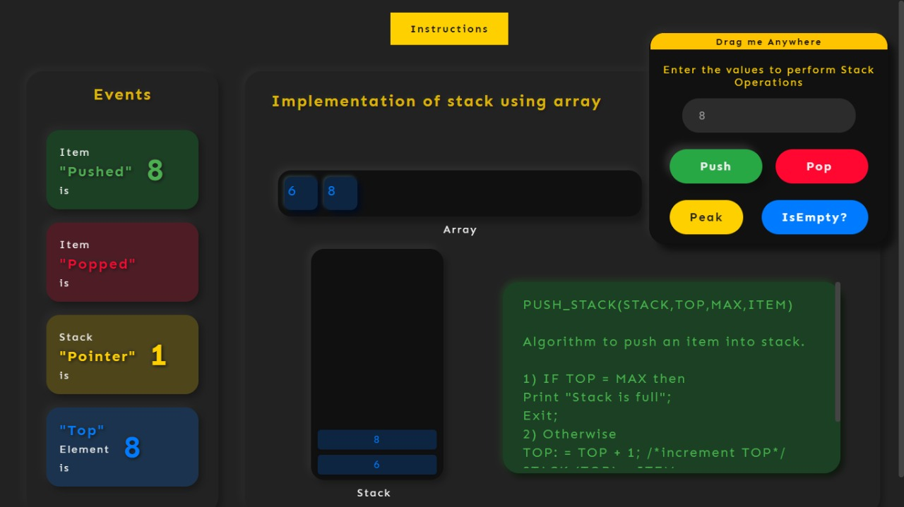
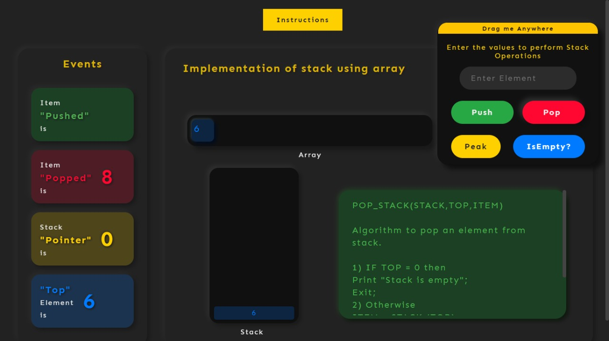
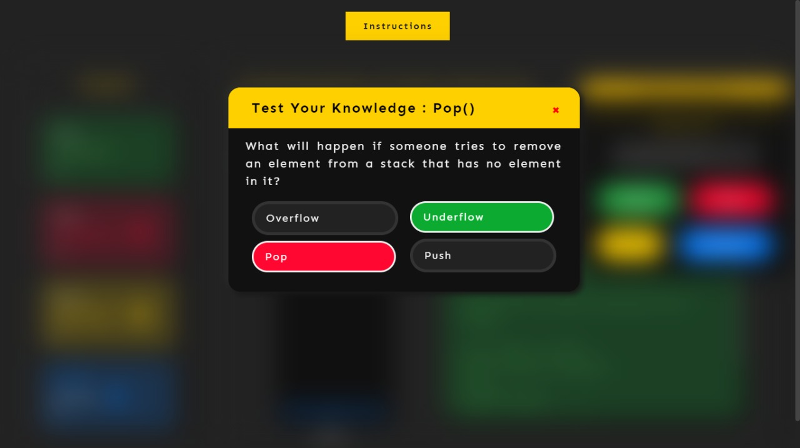
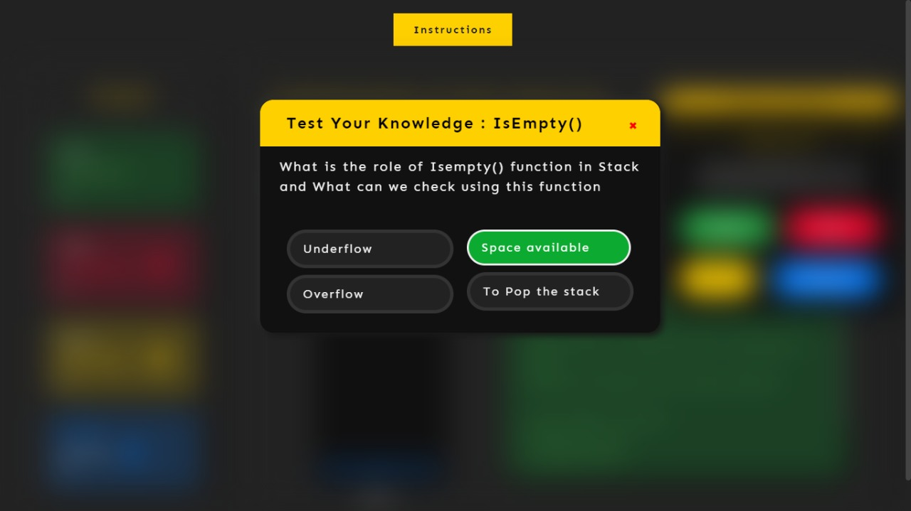

##### These procedure steps will be followed on the simulator  
1. After going through the theory and pretest, click the "Simulation" tab  
2.The simulator will display the instruction,user will read the instruction   
 
3.After clicking on "Create your own stack?"simulator appear with emplty stack:   
  
4.Providing input and after clicing on "push" button:   
  
5.A quiz window pop to ask question about push operation    
  
6.Clicking on "pop" button:    
 
7.A quiz window pop to ask queastion about pop operation  
 
8.A quiz window pop to ask question about isempty operation    
 

