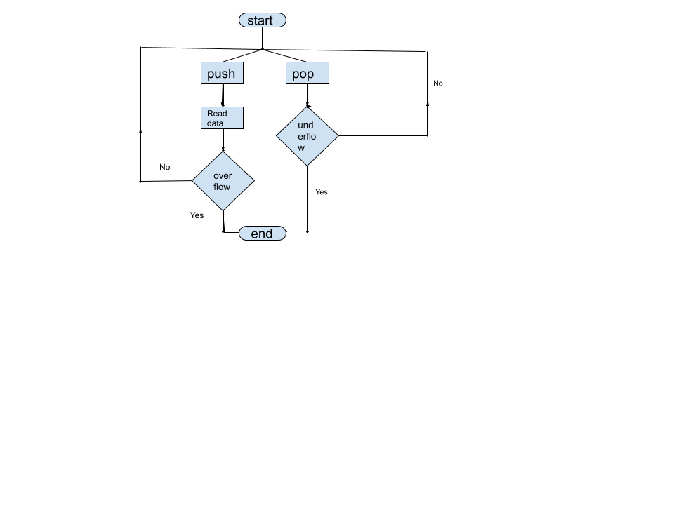

## Storyboard (Round 2)

Experiment Implementation of Stack using Array .

### 1. Story Outline:
Stack is a linear data structure which follows a particular order in which the operations are performed.A stack is Last In First Out (LIFO) abstract data type.
There are many real-life examples of a stack. Consider an example of plates stacked over one another in the canteen. The plate which is at the top is the first one to be removed, i.e. the plate which has been placed at the bottommost position remains in the stack for the longest period of time. So, it can be simply seen to follow LIFO order.
### 2. Story:

In this experiment mainly we are going to semulate following these basic oparations on stack given below: Push:Adds an item in the stack. If the stack is full, then it is said to be an Overflow condition. Pop:Removes an item from the stack. The items are popped in the reversed order in which they are pushed. If the stack is empty, then it is said to be an Underflow condition. Peek or Top:Returns top element of stack. isEmpty:Returns true if stack is empty, else false.

#### 2.1 Set the Visual Stage Description:
The simulator screen has many boxes named "Events",a box representing array,a box representing Stack and box containing two input field and four bottons named "Push","pop","IsPeak?",IsEmpty?".The Event box shows the operation performed omn the satck.The box represeniting Stack can conatain maximum 8 items.

#### 2.2 Set User Objectives & Goals:
Stack play a major rule in programming field because recursion is totally based on stack which plays a major rule in major data structures like trees and graph.So,Here user learn the concept of stack.Here student will understand the all operations of the stack through algorithm visualisation. 

#### 2.3 Set the Pathway Activities:
1.There is push button which push the element in the stack which is given by the user.
2.Pop button will remove the element at the top of the stack.
3.isPeak will tell the peak element in the stack.
4.Isempty tell whether the stack is empty or not.

##### 2.4 Set Challenges and Questions/Complexity/Variations in Questions:
Challenge 1.Write a program to implement a Stack using Array. Your task is to use the class as shown in the comments in the code editor and complete the functions push() and pop() to implement a stack. 

Example 1:

Input: 
push(2)
push(3)
pop()
push(4) 
pop()
Output: 3, 4

##### 2.5 Allow pitfalls:
The simulator have stack of only 8 size. 

##### 2.6 Conclusion:
1.Time taken by the user is 1min. 
2.User learn algorithm step by step will take 10 min. 
3.Overall time taken for the simulator is 11min. 

### 3. Flowchart 
 
### 4. Mindmap:
 

### 5. Storyboard :
1. After pushing of first element: 

2.After poping an eliment: 

3.Stack is full(overflow condition): 

